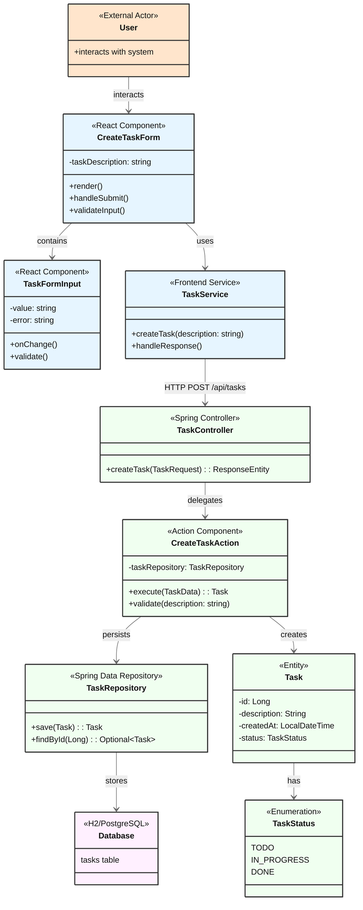
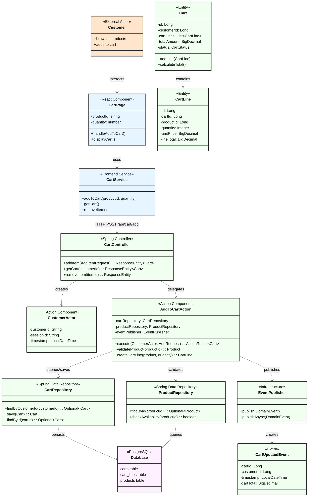

# Architecture Documentation Template

## Instructions for AI Assistants

When creating architecture diagrams, You MUST follow these rules:

### Color Coding Requirements
- You MUST apply these colors consistently:
  - `fill:#ffe5cc` - External Actors (orange/peach)
  - `fill:#e6f5ff` - Frontend Components (light blue)
  - `fill:#f0fff0` - Backend Components (light green)
  - `fill:#fff0ff` - Database/Persistence (light purple)
- You MUST include the color style definitions at the end of the diagram
- You MUST use stroke:#333,stroke-width:2px for all colored elements

### Component Rules
- You MUST use stereotypes to identify component types:
  - `<<External Actor>>` for users and external systems
  - `<<React Component>>` for frontend components
  - `<<Frontend Service>>` for frontend services (API communication)
  - `<<Spring Controller>>` or `<<Controller>>` for REST controllers
  - `<<Action Component>>` for Mosy Actions (business logic)
  - `<<Repository>>` or `<<Spring Data Repository>>` for data access
  - `<<Entity>>` for domain entities
  - `<<Enumeration>>` for enums
  - `<<Event>>` for domain events
  - `<<EventHandler>>` for event processors
- You MUST NOT create backend Service layer classes (Actions are the business logic layer)
- You MUST show Controllers delegating to Actions, not Services
- Frontend services (e.g., TaskService) are acceptable for API communication

### Architecture Patterns
- You MUST follow the pattern: Controller → Actor + Action → Repository → Database
- You MUST create per-flow diagrams showing only relevant components
- You MUST create an overall system diagram combining all flows
- You MUST show relationships with arrows and descriptive labels

## Example 1: Task Management System (Overall Architecture)

### Component Architecture Diagram

## Component Legend

- 🟧 **External Actor** (Orange) - User interacting with the system
- 🟦 **Frontend Components** (Light Blue) - React components and services
- 🟩 **Backend Components** (Light Green) - Spring Boot controllers, actions, repositories, and entities
- 🟪 **Database** (Light Purple) - Persistence layer

## Component Descriptions

### Frontend
- **CreateTaskForm**: Main form component for task creation
- **TaskFormInput**: Reusable input component with validation
- **TaskService**: Service layer for API communication

### Backend
- **TaskController**: REST API endpoint handler
- **CreateTaskAction**: Business logic for task creation (Mosy pattern - replaces traditional service)
- **TaskRepository**: Data access layer
- **Task**: Entity representing a task in the system
- **TaskStatus**: Enum defining valid task states

### Persistence
- **Database**: SQL

## Technology Stack

### Frontend
- React 18+
- TypeScript
- Axios (for HTTP requests)

### Backend
- Spring Boot 3.x
- Spring Web (REST)
- Spring Data JPA
- Java 17+

### Database
- H2 Database (development)
- PostgreSQL (production-ready)

## API Contracts

### REST API Specification

The complete REST API specification is documented in OpenAPI 3.0 format:

📄 **[OpenAPI Specification](./openapi-spec.yaml)**

### Event-Driven API Specification

The event-driven architecture is documented in AsyncAPI 3.0 format:

📄 **[AsyncAPI Specification](./asyncapi-spec.yaml)**

## Example 2: Add to Cart Flow Architecture (Per-Flow Diagram)

### Flow-Specific Architecture

This diagram shows only the components involved in the Add to Cart flow:

### Key Architecture Principles

#### Layered pattern
The architecture uses a Controller/Action/Repository layered structure and avoids a traditional service layer:
- **Actions replace Services**: AddToCartAction contains ALL business logic
- **Direct delegation**: Controller → Action (no intermediate service)
- **Clear responsibility**: Actions handle business rules, validations, and orchestration

#### Event-Driven Design
- Actions publish events when needed for downstream processing
- Events enable loose coupling between components
- Async processing for non-critical operations

#### Actor-Action Pattern
- CustomerActor provides execution context
- Actions are stateless and reusable
- Clear separation between who (Actor) and what (Action)

## Architecture Layers Explained

### Frontend Layer (Light Blue)
- **Components**: User interface elements
- **Frontend Services**: API communication and state management
- Acceptable to have "Service" classes here for API abstraction

### Backend Layer (Light Green)
- **Controllers**: HTTP request handling and response formatting
- **Actors**: Execution context (who is performing the action)
- **Actions**: Business logic implementation (replaces service layer)
- **Repositories**: Data access abstraction
- **Entities**: Domain model objects
- **Events**: Domain events for async processing

### Persistence Layer (Light Purple)
- **Database**: Relational or NoSQL storage
- **Tables/Collections**: Data structures
- **Indexes**: Performance optimization

### External Layer (Orange/Peach)
- **Users**: Human actors
- **External Systems**: Third-party integrations
- **External APIs**: Outside services

## Design Patterns Used

### Mosy Actor-Action Pattern
- Replaces traditional service layer
- Clear separation of concerns
- Testable business logic

### Repository Pattern
- Abstracts data access
- Enables testing with mocks
- Supports multiple data sources

### Event-Driven Architecture
- Loose coupling between components
- Async processing capabilities
- Event sourcing potential

### Command Pattern
- Actions as commands with execute method
- Encapsulated business operations
- Reusable and composable

---

© 2025 Mosy Software Architecture SL. All rights reserved.

Licensed to AgentGuild customers for internal use only. Distribution, copying, or derivative works prohibited without written permission. Contact: legal@mosy.tech