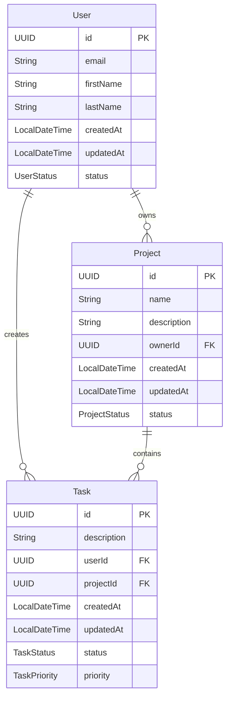
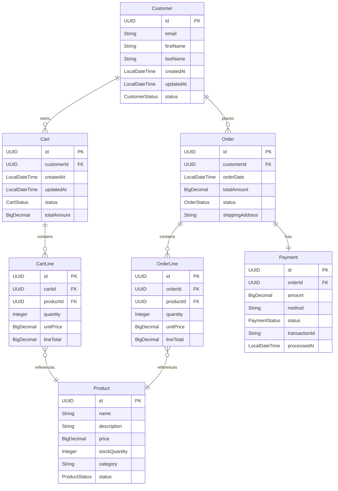

# Entity Model Template

## Instructions for AI Assistants

When creating entity models, You MUST follow these rules:

### Diagram Requirements
- You MUST use Mermaid erDiagram syntax
- You MUST show cardinality correctly:
  - `||--o{` for one-to-many (one required to many optional)
  - `||--||` for one-to-one (both required)
  - `}o--o{` for many-to-many (both optional)
  - `||--|{` for one-to-many (one required to many required)
- You MUST include all attributes with proper data types (UUID, String, LocalDateTime, BigDecimal, etc.)
- You MUST mark primary keys with "PK" and foreign keys with "FK"

### Naming and Structure
- You MUST use PascalCase for entity names
- You MUST use camelCase for attribute names
- You MUST NOT add entities not mentioned in flow specifications
- You MUST NOT add "Entity" suffix in diagram (it's implied)
- You MUST include an "Entity Specifications" section with detailed descriptions
- You MUST document all relationships with cascade behaviors

### Business Rules
- You MUST specify required vs optional fields
- You MUST define field constraints (max length, unique, etc.)
- You MUST explain business logic for each relationship
- You MUST document enum values for status fields
- You MUST specify default values where applicable

## Example 1: Task Management System (Primary Example)

### Entity Relationship Diagram

## Entity Specifications

### User
**Description**: Represents a user in the system who can create and manage tasks and projects.

**Attributes**:
- **id** (UUID): Unique identifier, auto-generated primary key
- **email** (String): User's email address
  - Required field
  - Must be unique across all users
  - Maximum length: 255 characters
- **firstName** (String): User's first name
  - Optional field
  - Maximum length: 100 characters
- **lastName** (String): User's last name
  - Optional field
  - Maximum length: 100 characters
- **createdAt** (LocalDateTime): Timestamp when the user was created
  - Automatically set by the system
  - Cannot be modified by user
- **updatedAt** (LocalDateTime): Timestamp of last update
  - Automatically updated by the system
- **status** (UserStatus Enum): Current state of the user account
  - Possible values: ACTIVE, INACTIVE, SUSPENDED
  - Default value: ACTIVE

**Business Rules**:
- Email must be valid and unique
- A user can create multiple tasks
- A user can own multiple projects
- User status determines access to the system

### Project
**Description**: Represents a project that groups related tasks together for organization and tracking.

**Attributes**:
- **id** (UUID): Unique identifier, auto-generated primary key
- **name** (String): Project name
  - Required field
  - Maximum length: 100 characters
- **description** (String): Project description
  - Optional field
  - Maximum length: 500 characters
- **ownerId** (UUID): Reference to the User who owns the project
  - Required field
  - Foreign key to User.id
- **createdAt** (LocalDateTime): Timestamp when the project was created
  - Automatically set by the system
  - Cannot be modified by user
- **updatedAt** (LocalDateTime): Timestamp of last update
  - Automatically updated by the system
- **status** (ProjectStatus Enum): Current state of the project
  - Possible values: ACTIVE, ARCHIVED, COMPLETED
  - Default value: ACTIVE

**Business Rules**:
- A project must have an owner
- A project can contain multiple tasks
- Archived projects cannot receive new tasks
- Only the owner can modify project details

### Task
**Description**: Represents a unit of work that needs to be tracked in the system.

**Attributes**:
- **id** (UUID): Unique identifier, auto-generated primary key
- **description** (String): The task description provided by the user
  - Required field
  - Maximum length: 500 characters
- **userId** (UUID): Reference to the User who created the task
  - Required field
  - Foreign key to User.id
- **projectId** (UUID): Reference to the Project this task belongs to
  - Required field
  - Foreign key to Project.id
- **createdAt** (LocalDateTime): Timestamp when the task was created
  - Automatically set by the system
  - Cannot be modified by user
- **updatedAt** (LocalDateTime): Timestamp of last update
  - Automatically updated by the system
- **status** (TaskStatus Enum): Current state of the task
  - Possible values: TODO, IN_PROGRESS, DONE
  - Default value: TODO
  - Set automatically on creation
- **priority** (TaskPriority Enum): Priority level of the task
  - Possible values: LOW, MEDIUM, HIGH
  - Default value: MEDIUM

**Business Rules**:
- A task must have a description
- A task must be associated with a user (creator)
- A task must belong to a project
- The creation timestamp is immutable once set
- All new tasks start with TODO status
- Task priority can be changed at any time

## Relationships

### User → Task (1:N)
- **Relationship**: One-to-Many
- **Description**: A User can create multiple Tasks
- **Foreign Key**: Task.userId references User.id
- **Cascade**: Delete user cascades to delete their tasks
- **Business Rule**: Every task must have a creator

### Project → Task (1:N)
- **Relationship**: One-to-Many
- **Description**: A Project can contain multiple Tasks
- **Foreign Key**: Task.projectId references Project.id
- **Cascade**: Delete project cascades to delete all tasks in the project
- **Business Rule**: Every task must belong to a project

### User → Project (1:N)
- **Relationship**: One-to-Many
- **Description**: A User can own multiple Projects
- **Foreign Key**: Project.ownerId references User.id
- **Cascade**: Delete user cascades to delete their owned projects
- **Business Rule**: Every project must have an owner

## Persistence
- Stored in relational database (H2 for development, configurable for production)
- Table names: `users`, `projects`, `tasks`
- All foreign key relationships enforced at database level
- Indexes on foreign keys for query performance

## Example 2: E-Commerce System (Advanced Example)

### Entity Relationship Diagram

### E-Commerce Entity Specifications

#### Customer
**Description**: Represents a customer who can browse products and place orders.

**Business Rules**:
- Email must be unique across all customers
- Customer can have multiple carts (active, saved, abandoned)
- Customer can place multiple orders
- Deleting customer soft-deletes their data for compliance

#### Cart
**Description**: Shopping cart holding selected items before checkout.

**Business Rules**:
- Only one active cart per customer at a time
- Cart expires after 30 days of inactivity
- Cart total is sum of all CartLine totals
- Status values: ACTIVE, SAVED, ABANDONED, CONVERTED

#### Product
**Description**: Items available for purchase in the catalog.

**Business Rules**:
- Stock quantity must be >= 0
- Price changes don't affect existing orders
- Products can be deactivated but not deleted
- Status values: ACTIVE, DISCONTINUED, OUT_OF_STOCK

#### Order
**Description**: Confirmed purchase containing one or more products.

**Business Rules**:
- Order cannot be modified after creation
- Order must have at least one OrderLine
- Status progression: PENDING → PAID → SHIPPED → DELIVERED
- Orders are immutable for audit purposes

#### Payment
**Description**: Payment transaction for an order.

**Business Rules**:
- One payment per order (no partial payments)
- Payment amount must match order total
- Failed payments can be retried
- Status values: PENDING, SUCCESS, FAILED, REFUNDED

### E-Commerce Relationships

#### Customer → Cart (1:N)
- **Cascade**: Delete customer archives carts
- **Business Rule**: Customer can have multiple carts over time

#### Customer → Order (1:N)
- **Cascade**: Delete customer preserves orders (audit requirement)
- **Business Rule**: Orders remain for legal/tax purposes

#### Cart → CartLine (1:N)
- **Cascade**: Delete cart removes all cart lines
- **Business Rule**: Cart lines cannot exist without cart

#### Order → OrderLine (1:N)
- **Cascade**: Orders and lines are immutable
- **Business Rule**: Order lines are permanent records

#### Order → Payment (1:1)
- **Cascade**: Payment record preserved even if order canceled
- **Business Rule**: Payment audit trail required

---

© 2025 Mosy Software Architecture SL. All rights reserved.

Licensed to AgentGuild customers for internal use only. Distribution, copying, or derivative works prohibited without written permission. Contact: legal@mosy.tech