```mermaid
%%{init: {'theme':'neutral', 'themeVariables': { 'primaryColor':'#fff', 'primaryTextColor':'#000', 'primaryBorderColor':'#000', 'lineColor':'#000', 'signalColor':'#000', 'signalTextColor':'#000'}}}%%
sequenceDiagram
    participant Customer as Customer 👤
    participant ProductPage as ProductPage 🖼️
    participant ProductService as ProductService 🖼️
    participant API as /api/products 🔌
    participant ProductController as ProductController ⚙️
    participant CustomerActor as CustomerActor ⚙️
    participant BrowseAction as BrowseProductsAction ⚙️
    participant ProductRepo as ProductRepository ⚙️
    participant Database as Database 🗄️

    rect rgb(255, 245, 230)
        Note over Customer: External Actor
        Customer->>ProductPage: Browse products
    end

    rect rgb(230, 245, 255)
        Note over ProductPage, ProductService: Frontend Components
        ProductPage->>ProductPage: Component mounts
        ProductPage->>ProductService: loadProducts()
        ProductService->>API: GET /api/products
    end

    rect rgb(240, 255, 240)
        Note over ProductController, ProductRepo: Backend Components
        API->>ProductController: browseProducts(request)
        ProductController->>CustomerActor: new CustomerActor(customerId)
        ProductController->>BrowseAction: new BrowseProductsAction()
        ProductController->>BrowseAction: execute(customerActor, browseRequest)
        BrowseAction->>ProductRepo: findAllActive()
    end

    rect rgb(255, 240, 255)
        Note over Database: Persistence Layer
        ProductRepo->>Database: SELECT * FROM products WHERE status='ACTIVE'
        Database-->>ProductRepo: Product list
    end

    rect rgb(240, 255, 240)
        Note over ProductController, ProductRepo: Backend Response
        ProductRepo-->>BrowseAction: List<Product>
        BrowseAction-->>ProductController: ActionResult<ProductList>
        ProductController-->>API: 200 OK + Product JSON array
    end

    rect rgb(230, 245, 255)
        Note over ProductPage, ProductService: Frontend Response
        API-->>ProductService: Product data
        ProductService-->>ProductPage: Products loaded
        ProductPage-->>Customer: Display product catalog
    end
```

# Sequence Diagram Template

**Version**: 1.0.0
**Last Updated**: 2025-08-29

**Note**: Replace "NAME" in the filename with the actual flow name (e.g., `flow-create-task-sequence-diagram.md`)

## Instructions for AI Assistants

When creating sequence diagrams, You MUST follow these rules:

### Visual Requirements
- You MUST use these icons in participant names:
  - 👤 for User/Customer
  - 🖼️ for Frontend Components (Pages, Forms, Components)
  - 🔌 for API Layer endpoints
  - ⚙️ for Backend Components (Controllers, Actions, Repositories)
  - 🗄️ for Database
  - 📨 for Event Handlers

- You MUST use these colored rectangles for grouping:
  - `rect rgb(255, 245, 230)` - External Actors (peach/orange)
  - `rect rgb(230, 245, 255)` - Frontend Components (light blue)
  - `rect rgb(240, 255, 240)` - Backend Components (light green)
  - `rect rgb(255, 240, 255)` - Persistence Layer (light purple)

- You MUST include the theme initialization:
  ```
  %%{init: {'theme':'neutral', 'themeVariables': { 'primaryColor':'#fff', 'primaryTextColor':'#000', 'primaryBorderColor':'#000', 'lineColor':'#000', 'signalColor':'#000', 'signalTextColor':'#000'}}}%%
  ```

### Mosy Actor-Action Pattern
- You MUST show Controllers creating Actors: `Controller->>Actor: new CustomerActor(customerId)`
- You MUST show Controllers creating Actions: `Controller->>Action: new CreateTaskAction()`
- You MUST use execute pattern: `Controller->>Action: execute(actor, request)`
- You MUST NOT create Service layer classes in backend (Actions replace Services)
- Frontend services (like TaskService) are acceptable for API communication

### Event Handling
- You MUST show event publishing with self-referencing arrows: `Action-->>Action: publish EventName`
- You MUST distinguish CustomerActor from SystemActor
- You MUST show EventHandlers with 📨 icon for system-initiated flows
- You MUST use async message arrows (-->>) for event responses

## Example 1: Create Task Flow (Primary Example)

### Sequence Diagram



```mermaid
%%{init: {'theme':'neutral', 'themeVariables': { 'primaryColor':'#fff', 'primaryTextColor':'#000', 'primaryBorderColor':'#000', 'lineColor':'#000', 'signalColor':'#000', 'signalTextColor':'#000'}}}%%
sequenceDiagram
    participant User as User 👤
    participant CreateTaskForm as CreateTaskForm 🖼️
    participant TaskService as TaskService 🖼️
    participant API as /api/tasks 🔌
    participant TaskController as TaskController ⚙️
    participant CreateTaskAction as CreateTaskAction ⚙️
    participant TaskRepository as TaskRepository ⚙️
    participant Database as Database 🗄️

    rect rgb(255, 245, 230)
        Note over User: External Actor
        User->>CreateTaskForm: Enter task description
    end

    rect rgb(230, 245, 255)
        Note over CreateTaskForm, TaskService: Frontend Components
        CreateTaskForm->>CreateTaskForm: Validate input (not empty)
        CreateTaskForm->>TaskService: submitTask(description)
        TaskService->>API: POST {description}
    end

    rect rgb(240, 255, 240)
        Note over TaskController, TaskRepository: Backend Components
        API->>TaskController: handleCreateTask(request)
        TaskController->>CreateTaskAction: execute(taskData)
        CreateTaskAction->>CreateTaskAction: Validate (required, max 500 chars)
        CreateTaskAction->>CreateTaskAction: Create Task entity<br/>(id, description, createdAt, status=TODO)
        CreateTaskAction->>TaskRepository: save(task)
    end

    rect rgb(255, 240, 255)
        Note over Database: Persistence Layer
        TaskRepository->>Database: INSERT INTO tasks
        Database-->>TaskRepository: Task saved
    end

    rect rgb(240, 255, 240)
        Note over TaskController, TaskRepository: Backend Response
        TaskRepository-->>CreateTaskAction: Saved task
        CreateTaskAction-->>TaskController: Task created
        TaskController-->>API: 201 Created + Task JSON
    end

    rect rgb(230, 245, 255)
        Note over CreateTaskForm, TaskService: Frontend Response
        API-->>TaskService: Response
        TaskService-->>CreateTaskForm: Task created
        CreateTaskForm-->>User: Display success
    end
```

## Component Legend

- 👤 **User** (Orange background) - External actor interacting with the system
- 🖼️ **Frontend Components** (Light Blue background) - React components and services
- 🔌 **API Layer** - REST endpoint interface
- ⚙️ **Backend Components** (Light Green background) - Spring Boot controllers, actions, and repositories
- 🗄️ **Database** (Light Purple background) - Persistence layer

## Flow Description

This sequence diagram illustrates the complete flow for creating a new task:

1. **User Interaction**: User enters a task description in the frontend form
2. **Frontend Validation**: CreateTaskForm validates the input is not empty
3. **API Call**: TaskService sends POST request to the backend
4. **Backend Processing**:
   - TaskController receives the request
   - CreateTaskAction validates and creates the Task entity
   - TaskRepository persists the task to the database
5. **Response**: Created task is returned to the user with 201 status

## Error Scenarios

The following error scenarios are handled:

- **Empty Description**: Frontend validation prevents submission
- **Description Too Long**: Backend returns 400 Bad Request
- **Database Error**: Backend returns 500 Internal Server Error

## Example 2: Browse Products Flow (E-Commerce)

### Sequence Diagram



### Flow Description

1. **Customer Interaction**: Customer navigates to product catalog
2. **Frontend Loading**: ProductPage component requests product data
3. **API Call**: ProductService sends GET request to backend
4. **Backend Processing**:
   - ProductController creates CustomerActor for context
   - BrowseProductsAction retrieves active products
   - ProductRepository queries database
5. **Response**: Product list returned and displayed to customer

## Example 3: Add to Cart Flow with Event Publishing

### Sequence Diagram


### Flow Description

1. **Customer Action**: Customer clicks "Add to Cart" button
2. **Frontend Processing**: CartPage collects product details and quantity
3. **API Request**: CartService sends POST with product information
4. **Backend Logic**:
   - CartController creates CustomerActor for authorization context
   - AddToCartAction validates product and availability
   - Creates or updates cart with new item
   - Publishes CartUpdatedEvent for downstream processing
5. **Event Publishing**: Event sent to EventBus for async handling
6. **Response**: Updated cart returned and displayed to customer

### Event-Driven Continuation

The CartUpdatedEvent can trigger additional async flows:
- Inventory reservation
- Recommendation engine updates
- Analytics tracking
- Cart abandonment monitoring

## Mosy Pattern Guidelines

### Actor Types
- **CustomerActor**: For user-initiated actions
- **SystemActor**: For system-initiated/async actions
- **AdminActor**: For administrative operations

### Action Patterns
- Actions encapsulate ALL business logic
- Actions are stateless and reusable
- Actions produce events for async processing
- Actions use repositories for data access

### Event Patterns
- Events are immutable
- Events contain all necessary data
- Events enable loose coupling
- Events support eventual consistency

---

© 2025 Mosy Software Architecture SL. All rights reserved.

Licensed to AgentGuild customers for internal use only. Distribution, copying, or derivative works prohibited without written permission. Contact: legal@mosy.tech