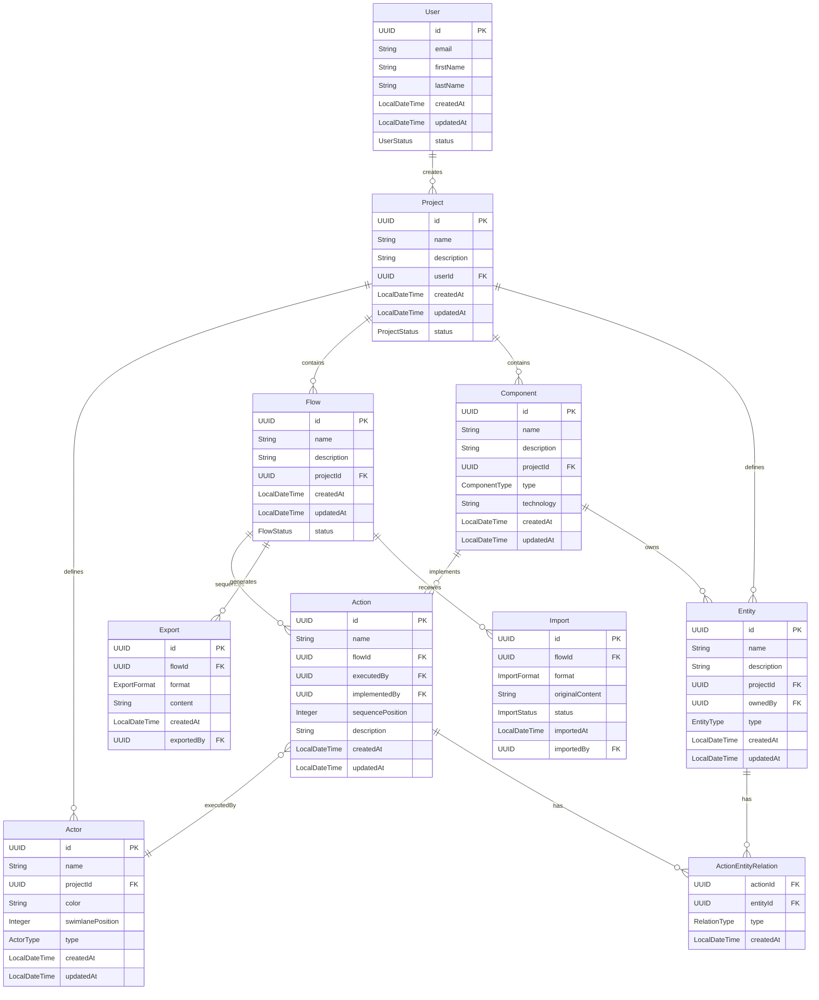

# Entity Model - MOSY Diagram Builder

## Entity Relationship Diagram

## Entity Specifications

### User
**Description**: Represents a user who can create and manage MOSY diagram projects.

**Attributes**:
- **id** (UUID): Unique identifier, auto-generated primary key
- **email** (String): User's email address
  - Required field
  - Must be unique across all users
  - Maximum length: 255 characters
  - Used for authentication
- **firstName** (String): User's first name
  - Optional field
  - Maximum length: 100 characters
- **lastName** (String): User's last name
  - Optional field
  - Maximum length: 100 characters
- **createdAt** (LocalDateTime): Timestamp when the user was created
  - Automatically set by the system
  - Cannot be modified by user
- **updatedAt** (LocalDateTime): Timestamp of last update
  - Automatically updated by the system
- **status** (UserStatus Enum): Current state of the user account
  - Possible values: ACTIVE, INACTIVE, SUSPENDED
  - Default value: ACTIVE

**Business Rules**:
- Email must be valid and unique
- A user can create multiple projects
- User status determines access to the system
- All projects are private to the user who created them

### Project
**Description**: Top-level container that holds actors and flows for a MOSY system model.

**Attributes**:
- **id** (UUID): Unique identifier, auto-generated primary key
- **name** (String): Project name
  - Required field
  - Maximum length: 100 characters
  - Must be unique per user
- **description** (String): Project description
  - Optional field
  - Maximum length: 500 characters
- **userId** (UUID): Reference to the User who owns the project
  - Required field
  - Foreign key to User.id
- **createdAt** (LocalDateTime): Timestamp when the project was created
  - Automatically set by the system
  - Cannot be modified
- **updatedAt** (LocalDateTime): Timestamp of last update
  - Automatically updated by the system
- **status** (ProjectStatus Enum): Current state of the project
  - Possible values: ACTIVE, ARCHIVED
  - Default value: ACTIVE

**Business Rules**:
- A project must have a unique name per user
- A project defines all actors available across its flows
- A project can contain multiple flows
- Deleting a project cascades to delete all actors, flows, and actions
- Actors defined at project level are reusable across all flows

### Actor
**Description**: Represents an actor in the MOSY framework who can execute actions across different flows.

**Attributes**:
- **id** (UUID): Unique identifier, auto-generated primary key
- **name** (String): Actor name
  - Required field
  - Maximum length: 100 characters
  - Must be unique within a project
- **projectId** (UUID): Reference to the Project this actor belongs to
  - Required field
  - Foreign key to Project.id
- **color** (String): Hex color code for swimlane visualization
  - Optional field
  - Format: #RRGGBB
  - Default: System assigns from palette
- **swimlanePosition** (Integer): Order position in the swimlane diagram
  - Required field
  - Zero-based index
  - Determines vertical order in diagram (0 = top)
- **type** (ActorType Enum): Type of actor
  - Possible values: USER, SYSTEM, EXTERNAL
  - USER: Human users of the system
  - SYSTEM: Internal system processes
  - EXTERNAL: External systems or services
- **createdAt** (LocalDateTime): Timestamp when the actor was created
  - Automatically set by the system
- **updatedAt** (LocalDateTime): Timestamp of last update
  - Automatically updated by the system

**Business Rules**:
- An actor must have a unique name within its project
- Actors are shared across all flows in the project
- Each actor gets a dedicated swimlane in diagrams
- Swimlane position is consistent across all flows
- An actor can execute actions in multiple flows

### Flow
**Description**: Represents a sequence of actions that defines a business process or user journey.

**Attributes**:
- **id** (UUID): Unique identifier, auto-generated primary key
- **name** (String): Flow name
  - Required field
  - Maximum length: 100 characters
  - Must be unique within a project
- **description** (String): Flow description
  - Optional field
  - Maximum length: 500 characters
  - Describes the business process
- **projectId** (UUID): Reference to the Project this flow belongs to
  - Required field
  - Foreign key to Project.id
- **createdAt** (LocalDateTime): Timestamp when the flow was created
  - Automatically set by the system
  - Cannot be modified
- **updatedAt** (LocalDateTime): Timestamp of last update
  - Automatically updated by the system
  - Updates when actions are modified
- **status** (FlowStatus Enum): Current state of the flow
  - Possible values: DRAFT, ACTIVE, ARCHIVED
  - Default value: DRAFT
  - DRAFT: Being edited
  - ACTIVE: Currently selected/in use
  - ARCHIVED: Saved but not actively used

**Business Rules**:
- A flow must have a unique name within its project
- A flow contains a sequence of actions
- Only one flow can be ACTIVE per project at a time
- Deleting a flow cascades to delete all its actions
- Flow uses the actors defined in its parent project
- Flow state is preserved when switching between flows

### Action
**Description**: Represents an action in a flow sequence, executed by a specific actor and implemented by a component.

**Attributes**:
- **id** (UUID): Unique identifier, auto-generated primary key
- **name** (String): Action name
  - Required field
  - Maximum length: 100 characters
- **flowId** (UUID): Reference to the Flow this action belongs to
  - Required field
  - Foreign key to Flow.id
- **executedBy** (UUID): Reference to the Actor who executes this action
  - Required field
  - Foreign key to Actor.id
  - Actor must exist in the same project as the flow
- **implementedBy** (UUID): Reference to the Component that implements this action
  - Optional field
  - Foreign key to Component.id
  - Component must exist in the same project
- **sequencePosition** (Integer): Order position in the flow sequence
  - Required field
  - Zero-based index
  - Determines horizontal position and arrow connections
- **description** (String): Optional detailed description
  - Optional field
  - Maximum length: 500 characters
  - Used for tooltips and documentation
- **createdAt** (LocalDateTime): Timestamp when the action was created
  - Automatically set by the system
- **updatedAt** (LocalDateTime): Timestamp of last update
  - Automatically updated when reordered

**Business Rules**:
- An action must belong to exactly one flow
- An action must be executed by exactly one actor
- An action may be implemented by one component
- The actor must be defined in the same project as the flow
- Action sequencePosition determines order (0 = first)
- Actions are automatically connected with arrows based on sequence
- Reordering actions updates all affected position values
- Actions appear as nodes in the executing actor's swimlane
- Actions can create, update, or read multiple entities

### Entity
**Description**: Represents a business entity or data object that is defined at the project level and can be manipulated by actions across different flows.

**Attributes**:
- **id** (UUID): Unique identifier, auto-generated primary key
- **name** (String): Entity name
  - Required field
  - Maximum length: 100 characters
  - Must be unique within a project
- **description** (String): Entity description
  - Optional field
  - Maximum length: 500 characters
  - Describes the business meaning
- **projectId** (UUID): Reference to the Project this entity belongs to
  - Required field
  - Foreign key to Project.id
- **ownedBy** (UUID): Reference to the Component that owns this entity
  - Optional field
  - Foreign key to Component.id
  - Indicates which component manages this entity's lifecycle
- **type** (EntityType Enum): Type of entity
  - Possible values: DOMAIN, DTO, EVENT, VALUE_OBJECT
  - DOMAIN: Core business entity
  - DTO: Data transfer object
  - EVENT: Domain event
  - VALUE_OBJECT: Immutable value object
- **createdAt** (LocalDateTime): Timestamp when the entity was created
  - Automatically set by the system
- **updatedAt** (LocalDateTime): Timestamp of last update
  - Automatically updated by the system

**Business Rules**:
- An entity must have a unique name within its project
- Entities are shared across all flows in the project (like actors and components)
- An entity may be owned by a component
- Entities track their relationships with actions through ActionEntityRelation
- Multiple actions can create, update, or read the same entity
- Entity lifecycle is tracked through action relationships
- Entities are reusable across different flows within the same project

### Component
**Description**: Represents a technical component that implements actions and owns entities within the system.

**Attributes**:
- **id** (UUID): Unique identifier, auto-generated primary key
- **name** (String): Component name
  - Required field
  - Maximum length: 100 characters
  - Must be unique within a project
- **description** (String): Component description
  - Optional field
  - Maximum length: 500 characters
  - Describes the component's responsibility
- **projectId** (UUID): Reference to the Project this component belongs to
  - Required field
  - Foreign key to Project.id
- **type** (ComponentType Enum): Type of component
  - Possible values: FRONTEND, BACKEND, SERVICE, REPOSITORY, CONTROLLER, LIBRARY
  - FRONTEND: UI components
  - BACKEND: Server-side components
  - SERVICE: Business logic services
  - REPOSITORY: Data access components
  - CONTROLLER: API controllers
  - LIBRARY: Shared libraries
- **technology** (String): Technology stack used
  - Optional field
  - Examples: "React", "Spring Boot", "Node.js"
  - Maximum length: 50 characters
- **createdAt** (LocalDateTime): Timestamp when the component was created
  - Automatically set by the system
- **updatedAt** (LocalDateTime): Timestamp of last update
  - Automatically updated by the system

**Business Rules**:
- A component must have a unique name within its project
- Components are shared across all flows in the project
- A component can implement multiple actions
- A component can own multiple entities
- Components represent the technical implementation layer
- Components help track which parts of the system implement business logic

### ActionEntityRelation
**Description**: Junction table that tracks the relationship between actions and entities (created, updated, or read).

**Attributes**:
- **actionId** (UUID): Reference to the Action
  - Required field
  - Foreign key to Action.id
  - Part of composite primary key
- **entityId** (UUID): Reference to the Entity
  - Required field
  - Foreign key to Entity.id
  - Part of composite primary key
- **type** (RelationType Enum): Type of relationship
  - Required field
  - Possible values: CREATES, UPDATES, READS
  - CREATES: Action creates new instance of entity
  - UPDATES: Action modifies existing entity
  - READS: Action reads entity without modification
- **createdAt** (LocalDateTime): Timestamp when the relationship was created
  - Automatically set by the system

**Business Rules**:
- An action can have multiple relationships with different entities
- An action can have multiple relationship types with the same entity
- The combination of (actionId, entityId, type) must be unique
- Relationships track data flow through the system
- Used for impact analysis and documentation

### Export
**Description**: Represents an exported version of a flow for sharing or backup.

**Attributes**:
- **id** (UUID): Unique identifier, auto-generated primary key
- **flowId** (UUID): Reference to the Flow that was exported
  - Required field
  - Foreign key to Flow.id
- **format** (ExportFormat Enum): Format of the export
  - Possible values: JSON, MERMAID, PNG
  - JSON: Complete flow structure
  - MERMAID: Mermaid diagram syntax
  - PNG: Rendered image
- **content** (String): The exported content
  - Required field
  - Format depends on ExportFormat
  - May be base64 encoded for binary formats
- **createdAt** (LocalDateTime): Timestamp when export was created
  - Automatically set by the system
- **exportedBy** (UUID): Reference to the User who exported
  - Required field
  - Foreign key to User.id

**Business Rules**:
- Exports are read-only once created
- Export content includes complete flow structure
- Exports can be used for reimporting flows
- PNG exports are for visualization only

### Import
**Description**: Represents an imported flow definition from external source.

**Attributes**:
- **id** (UUID): Unique identifier, auto-generated primary key
- **flowId** (UUID): Reference to the created Flow
  - Required field after successful import
  - Foreign key to Flow.id
  - Null if import failed
- **format** (ImportFormat Enum): Format of the imported content
  - Possible values: JSON, MERMAID
- **originalContent** (String): The original imported content
  - Required field
  - Preserved for audit trail
- **status** (ImportStatus Enum): Result of the import operation
  - Possible values: PENDING, SUCCESS, FAILED
  - PENDING: Being processed
  - SUCCESS: Flow created successfully
  - FAILED: Import failed validation
- **importedAt** (LocalDateTime): Timestamp when import occurred
  - Automatically set by the system
- **importedBy** (UUID): Reference to the User who imported
  - Required field
  - Foreign key to User.id

**Business Rules**:
- Import creates a new flow (doesn't update existing)
- Failed imports preserve original content for debugging
- Successful imports link to the created flow
- Import validation ensures data integrity

## Relationships

### User → Project (1:N)
- **Relationship**: One-to-Many
- **Description**: A User can create multiple Projects
- **Foreign Key**: Project.userId references User.id
- **Cascade**: Delete user cascades to delete their projects
- **Business Rule**: Projects are private to their creator

### Project → Actor (1:N)
- **Relationship**: One-to-Many
- **Description**: A Project defines multiple Actors
- **Foreign Key**: Actor.projectId references Project.id
- **Cascade**: Delete project cascades to delete all actors
- **Business Rule**: Actors are shared across all flows in the project

### Project → Flow (1:N)
- **Relationship**: One-to-Many
- **Description**: A Project contains multiple Flows
- **Foreign Key**: Flow.projectId references Project.id
- **Cascade**: Delete project cascades to delete all flows
- **Business Rule**: Each flow represents a different business process

### Project → Component (1:N)
- **Relationship**: One-to-Many
- **Description**: A Project defines multiple Components
- **Foreign Key**: Component.projectId references Project.id
- **Cascade**: Delete project cascades to delete all components
- **Business Rule**: Components are shared across all flows in the project

### Project → Entity (1:N)
- **Relationship**: One-to-Many
- **Description**: A Project defines multiple Entities
- **Foreign Key**: Entity.projectId references Project.id
- **Cascade**: Delete project cascades to delete all entities
- **Business Rule**: Entities are shared across all flows in the project, like actors and components

### Flow → Action (1:N)
- **Relationship**: One-to-Many
- **Description**: A Flow sequences multiple Actions
- **Foreign Key**: Action.flowId references Flow.id
- **Cascade**: Delete flow cascades to delete all actions
- **Business Rule**: Actions are ordered by sequencePosition

### Actor → Action (1:N)
- **Relationship**: One-to-Many (executedBy)
- **Description**: An Actor executes multiple Actions across flows
- **Foreign Key**: Action.executedBy references Actor.id
- **Cascade**: Cannot delete actor if actions reference it
- **Business Rule**: Each action must have an executor

### Component → Action (1:N)
- **Relationship**: One-to-Many (implementedBy)
- **Description**: A Component implements multiple Actions
- **Foreign Key**: Action.implementedBy references Component.id
- **Cascade**: Cannot delete component if actions reference it
- **Business Rule**: An action may be implemented by a component

### Component → Entity (1:N)
- **Relationship**: One-to-Many (owns)
- **Description**: A Component owns multiple Entities
- **Foreign Key**: Entity.ownedBy references Component.id
- **Cascade**: Cannot delete component if entities reference it
- **Business Rule**: An entity may be owned by a component that manages its lifecycle

### Action ↔ Entity (N:N)
- **Relationship**: Many-to-Many via ActionEntityRelation
- **Description**: Actions can create, update, or read multiple Entities
- **Junction Table**: ActionEntityRelation with (actionId, entityId, type)
- **Cascade**: Delete action or entity removes relationships
- **Business Rule**: Tracks data flow through CRUD operations

### Flow → Export (1:N)
- **Relationship**: One-to-Many
- **Description**: A Flow can be exported multiple times
- **Foreign Key**: Export.flowId references Flow.id
- **Cascade**: Delete flow preserves exports (audit trail)
- **Business Rule**: Exports are immutable snapshots

### Flow → Import (1:N)
- **Relationship**: One-to-Many
- **Description**: A Flow can be created from imports
- **Foreign Key**: Import.flowId references Flow.id
- **Cascade**: Delete flow preserves import records
- **Business Rule**: Each import creates a new flow

## Persistence

- **Database Type**: PostgreSQL (production) / H2 (development)
- **Tables**: `users`, `projects`, `actors`, `flows`, `actions`, `entities`, `components`, `action_entity_relations`, `exports`, `imports`
- **Indexes**:
  - projects.userId (foreign key index)
  - actors.projectId (foreign key index)
  - flows.projectId (foreign key index)
  - entities.projectId (foreign key index)
  - entities.ownedBy (foreign key index)
  - components.projectId (foreign key index)
  - actions.flowId (foreign key index)
  - actions.executedBy (foreign key index)
  - actions.implementedBy (foreign key index)
  - actions.sequencePosition (for sorting)
  - action_entity_relations.actionId (foreign key index)
  - action_entity_relations.entityId (foreign key index)
  - exports.flowId (foreign key index)
  - imports.flowId (foreign key index)
- **Constraints**:
  - Unique constraint on (project.name, project.userId)
  - Unique constraint on (actor.name, actor.projectId)
  - Unique constraint on (flow.name, flow.projectId)
  - Unique constraint on (entity.name, entity.projectId)
  - Unique constraint on (component.name, component.projectId)
  - Unique constraint on (actionId, entityId, type) in action_entity_relations
  - Check constraint on color format (regex for hex)
  - Check constraint on sequencePosition >= 0
  - Check constraint on swimlanePosition >= 0
  - Foreign key constraint: action.executedBy must reference actor in same project
  - Foreign key constraint: action.implementedBy must reference component in same project
  - Foreign key constraint: entity.ownedBy must reference component in same project

---

© 2025 Mosy Software Architecture SL. All rights reserved.